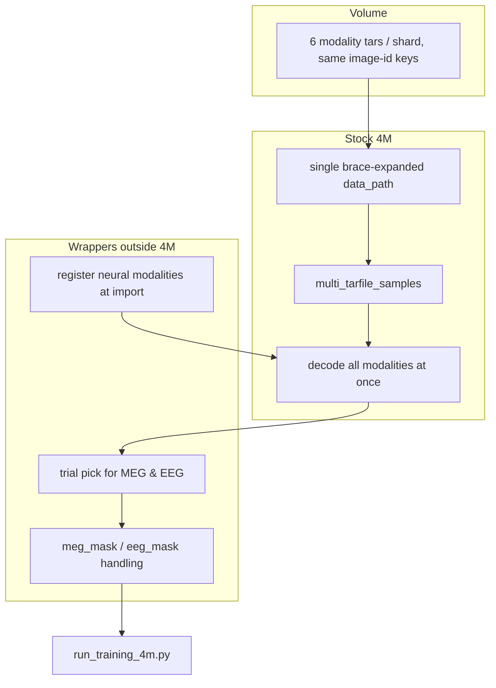

# `/project/data` — layout guide

This file lives on the shared **`project`** Modal volume. Paths below are absolute from the volume mount (`/project/data/...`).

## Top level

```
/project/data/
├── README.md                    ← you are here
├── things_catalog.json          # all 26,107 THINGS images: id ↔ filename
├── things_split.json            # canonical train/val split
├── eeg_coverage.json            # EEG image coverage (EEG1, EEG2, union)
├── train/                       # training split
├── val/                         # validation split
├── things-meg/                  # MEG raw + labels + token cache
├── things-eeg/                  # EEG raw + labels + token cache
└── cc12m/                       # separate dataset — not THINGS
```

## THINGS image IDs

- **26,107** images, ids **`000000001`** … **`000026107`**
- Each id is the 9-digit zero-padded **alphabetical rank** of the THINGS filename
- Lookup: `things_catalog.json` → `"image_id_to_filename"`

## Train / val split

**`things_split.json`** is probably the most useful reference for train/val membership on this volume.

| Split | Images | How val was chosen |
|-------|--------|--------------------|
| train | 22,763 | all catalog ids not in val |
| val   | 3,344  | 20% of catalog ∩ MEG ∩ (EEG1 ∩ EEG2) |

Legacy per-split manifests (`things_manifest.json`, `things_meg_manifest.json`, etc.) were removed after the catalog-slot repack — `things_split.json` + slot math may be easier to work with if you're deriving shard membership programmatically.

Each image id should appear in one of train or val, not both.

## 4M-ready shards (`train/things/`, `val/things/`)

Pretokenized **WebDataset** tars for multimodal 4M training. Six parallel folders per split:

```
train/things/{tok_rgb,tok_depth,tok_meg,tok_eeg,meg_mask,eeg_mask}/shard_NNN.tar
val/things/{...}/shard_NNN.tar
```

`NNN` = **000 … 026** (27 catalog slots). Slot for an image id:

```
shard_index = (int(image_id) - 1) // 1000
```

Example: `000001234` → `shard_001`.

### Per-modality contents

Each tar holds one entry per image: **`{image_id}.npy`**.

| Folder | Shape | Dtype | Meaning |
|--------|-------|-------|---------|
| `tok_rgb` | `(196,)` | int16 | RGB VQ tokens (224×224) |
| `tok_depth` | `(196,)` | int16 | depth VQ tokens |
| `tok_meg` | `(n_trials, 16, 8, 4)` | int16 | BrainOmni MEG RVQ; all trials stacked |
| `tok_eeg` | `(n_trials, 17)` | int16 | LaBraM EEG tokens; all trials stacked |
| `meg_mask` | `(1,)` | uint8 | `1` = real MEG, `0` = missing (sentinel) |
| `eeg_mask` | `(1,)` | uint8 | `1` = real EEG, `0` = missing (sentinel) |

**Missing MEG/EEG:** token array is shape `(1, …)` filled with **`-1`**; mask is **`0`**.

**Zip rule:** for 4M-style merging, it helps if all six folders for a given split share the **same** `{image_id}.npy` keys in each `shard_NNN.tar`. Train and val shards with the same index contain **different** image ids.

### 4M `data_path` example

```
/project/data/train/things/[tok_rgb,tok_depth,tok_meg,tok_eeg,meg_mask,eeg_mask]/shard_{000..026}.tar
/project/data/val/things/[tok_rgb,tok_depth,tok_meg,tok_eeg,meg_mask,eeg_mask]/shard_{000..026}.tar
```

Some val catalog slots have no val images → that val shard may be empty (0 samples); that is expected.

---

## 4M training plan — new data structure

Some thoughts on training against this volume, especially if you don't have access to private repo scripts. The data here is already repacked; the idea below is to lean on stock upstream 4M where possible and keep any custom logic in thin wrappers outside the 4M tree.

### Recommended approach

**Keeping 4M unmodified.** One path we've been exploring is to avoid forking or patching inside `fourm/` / `ml-4m/`. Upstream 4M seems to support loading many pretokenized modalities from a single brace-expanded path and merging them by sample key — which is roughly how this volume is organized.

**Single `data_path` for all modalities.** It may be worth trying one path that pulls in RGB, depth, MEG, EEG, and presence masks together:

```
/project/data/train/things/[tok_rgb,tok_depth,tok_meg,tok_eeg,meg_mask,eeg_mask]/shard_{000..026}.tar
```

In this model, 4M would open all six tars per shard index, zip rows by the 9-digit image id (`__key__`), and yield one dict per image with all modalities attached. Separate dataloaders, `MixtureDataset`, or per-modality manifest files might not be necessary — though your mileage may vary depending on 4M version and config.

**Custom code outside 4M.** If this approach works for you, the main additions would likely be small wrappers around the standard pipeline rather than changes inside 4M itself:

| Wrapper | Rationale | Possible placement |
|---------|-----------|-------------------|
| **Modality registration** | Stock 4M already knows `tok_rgb` / `tok_depth`; `tok_meg`, `tok_eeg`, `meg_mask`, `eeg_mask` may need entries in `MODALITY_INFO` and `MODALITY_TRANSFORMS`. Runtime registration at import time (monkey-patch) is one way to do this without editing 4M source. | Training script, before the loader is built |
| **MEG / EEG trial sampler** | Shards store all trials stacked per image (`tok_meg`: `(n_trials, 16, 8, 4)`, `tok_eeg`: `(n_trials, 17)`). You might want to pick one trial per step — e.g. random in train, fixed (trial 0) in eval — and collapse to a single-trial shape before batching. | Outer dataloader wrapper (e.g. after decode) |
| **Neural masking / sentinel handling** | Images without MEG or EEG have sentinel arrays (`-1` fill) plus `meg_mask=0` / `eeg_mask=0`. It could help to treat mask=0 as "modality absent" and avoid passing `-1` tokens through as real codes — either in a wrapper or via 4M's existing masking config. | Same wrapper layer, or `UnifiedMasking` settings |

Everything else — WebDataset, tar decode, zip-by-key, token casting, Dirichlet modality sampling, the trainer — would ideally stay as stock 4M.

```
┌─────────────────────────────────────────────────────────────┐
│  ON VOLUME — 6 modality folders, same keys per shard        │
└──────────────────────────┬──────────────────────────────────┘
                           │
                           ▼
┌─────────────────────────────────────────────────────────────┐
│  STOCK 4M (ideally unchanged)                               │
│  data_path brace expansion → multi_tarfile_samples → decode │
│  → all 6 modalities in one sample dict per image            │
└──────────────────────────┬──────────────────────────────────┘
                           │
                           ▼
┌─────────────────────────────────────────────────────────────┐
│  WRAPPERS (outside 4M repo)                                 │
│  · register tok_meg / tok_eeg / meg_mask / eeg_mask         │
│  · random (or fixed) trial pick for MEG & EEG               │
│  · meg_mask / eeg_mask for missing neural data              │
└──────────────────────────┬──────────────────────────────────┘
                           │
                           ▼
                    4M trainer
```

### Current state (on this volume)

As of the catalog-slot repack:

- **Split:** `things_split.json` — 22,763 train / 3,344 val image ids (val sampled from catalog ∩ MEG ∩ EEG intersection pool).
- **Layout:** catalog-slot shards — 27 slots (`shard_000` … `shard_026`) per split, keyed by image id.
- **Modalities:** six parallel folders per split (`tok_rgb`, `tok_depth`, `tok_meg`, `tok_eeg`, `meg_mask`, `eeg_mask`).
- **Raw RGB:** `train/things/rgb/` and `val/things/rgb/` follow the same catalog-slot keys (`{image_id}.jpg` + `{image_id}.txt`); not part of the pretokenized `data_path` above, but potentially useful for visualization or re-tokenization.
- **Legacy manifests removed** — `things_split.json` + slot math may be the simplest way to derive membership.

### Single-path loading (example sample shape)

For shard `shard_003`, if 4M opens six tars and merges by key, one sample might look like:

```
__key__     = "000003501"
tok_rgb     = (196,)            int16
tok_depth   = (196,)            int16
tok_meg     = (n_trials,16,8,4) int16   ← trial wrapper → (16,8,4)
tok_eeg     = (n_trials, 17)    int16   ← trial wrapper → (17,)
meg_mask    = (1,)              uint8   ← 1 = real, 0 = sentinel
eeg_mask    = (1,)              uint8
```

All six would arrive together if they share the same `{image_id}.npy` filename across modality tars. RGB and depth are fixed-shape; MEG/EEG stay variable until a trial sampler runs.

**Val path** (same pattern):

```
/project/data/val/things/[tok_rgb,tok_depth,tok_meg,tok_eeg,meg_mask,eeg_mask]/shard_{000..026}.tar
```

Mounting the `project` volume at `/project` and pointing `output_dir` somewhere writable (e.g. `/project/runs/<run_name>`) is a reasonable starting point.

### Possible downstream pieces (wrappers + config)

| Piece | Ideally outside 4M? | Notes |
|-------|---------------------|-------|
| **4M YAML config** | Yes | `data_path`, `val_data_path`, `all_domains`, `in_domains`, `out_domains`. Listing all six modalities in `all_domains` would match this layout. |
| **Modality registration** | Yes | Inject `tok_meg`, `tok_eeg`, `meg_mask`, `eeg_mask` into `fourm.data.modality_info` before the loader is built. MEG vocab is likely **512**, 512 tokens/trial (16×8×4). EEG shape on disk is `(n_trials, 17)` int16 — vocab should probably match your LaBraM tokenizer. |
| **Trial sampler wrapper** | Yes | After decode, if `tok_meg.ndim == 4`, index one trial; similar for `tok_eeg`. Random in train, trial 0 in eval is a common pattern. |
| **Mask-aware wrapper** | Yes | When `meg_mask[0]==0`, you might skip or zero-out MEG for that step. Sentinels are `-1` — treating them as invalid codes is probably safer. |
| **Modal GPU job** | Yes | Mount volume, install upstream 4M, import registration, call `run_training_4m.py`. |
| **Smoke test** | Yes | A few batches from `shard_000` printing all six keys + shapes can catch alignment issues early. |

One possible build order:

1. Inspect one shard — check member names match across all six modality tars.
2. Try stock 4M loader on one shard with rgb + depth only (already registered).
3. Add modality registration — see if all six decode in one sample.
4. Add trial sampler wrapper — check `(n_trials, …)` collapses as expected.
5. Add mask handling — try a few sentinel rows where `meg_mask=0`.
6. Scale to all 27 shards and both splits.

### Example 4M config (YAML sketch)

Illustrative — adapt to your 4M config schema and hyperparameters:

```yaml
all_domains: tok_rgb-tok_depth-tok_meg-tok_eeg-meg_mask-eeg_mask
data:
  things:
    type: multimodal
    use_wds: true
    data_path: /project/data/train/things/[tok_rgb,tok_depth,tok_meg,tok_eeg,meg_mask,eeg_mask]/shard_{000..026}.tar
    in_domains: tok_rgb-tok_depth-tok_meg-tok_eeg
    out_domains: tok_rgb-tok_depth-tok_meg-tok_eeg
    main_augment_domain: tok_rgb
    input_alphas: "1.0-1.0-1.0-1.0"
    target_alphas: "1.0-1.0-1.0-1.0"
val_data_path: /project/data/val/things/[tok_rgb,tok_depth,tok_meg,tok_eeg,meg_mask,eeg_mask]/shard_{000..026}.tar
output_dir: /project/runs/your_run_name
```

`in_domains` / `out_domains` control which modalities participate in masking — listing all four token modalities would train them together from the single path above.

### Notes that might help

1. **Mask names:** `meg_mask` and `eeg_mask` (without a `tok_` prefix) may work better — 4M's `tok_to_int64` casts `tok_*` keys to int64, which could affect `uint8` masks if named differently.

2. **Zip alignment:** for modalities in the same `data_path`, matching keys across tars seems important. Extra or missing keys in one tar might cause `multi_tarfile_samples` to raise or truncate.

3. **Trial sampling:** variable-shape `.npy` decode appears to work in stock 4M; collapsing `(n_trials, …)` to one trial would likely live in an outer wrapper, not inside 4M.

4. **Catalog slots vs split:** `shard_005` in train and `shard_005` in val contain different image ids — same slot index, different membership, both derivable from `things_split.json`.

5. **Empty val shards:** some catalog slots have no val images; the corresponding val tar might be empty. Worth checking how your 4M version handles zero-length shards.

6. **Missing MEG/EEG:** sentinel arrays + mask=0 are always present for those images. Dropping rows is an option, but the layout assumes you can keep them and mask appropriately.

7. **`filter_metadata`:** the keyless `map` from `fourm.data.unified_datasets` might behave differently from plain `wds.map` with respect to `__key__` — worth a quick check in your pipeline.

8. **`cc12m/`:** separate pretraining corpus on the same volume; probably best left alone when working on THINGS.

### Sanity checks (no private scripts needed)

Some lightweight checks you could run with the volume mounted:

```python
import json, tarfile, io, numpy as np

split = json.load(open("/project/data/things_split.json"))
train_ids = set(split["train_image_ids"])
val_ids = set(split["val_image_ids"])
# expect 22763 train, 3344 val, no overlap
print(len(train_ids), len(val_ids), train_ids.isdisjoint(val_ids))

def tar_keys(path):
    with tarfile.open(path) as t:
        return sorted(m.name.rsplit(".", 1)[0] for m in t if m.name.endswith(".npy"))

base = "/project/data/train/things"
mods = ["tok_rgb", "tok_depth", "tok_meg", "tok_eeg", "meg_mask", "eeg_mask"]
keys = {m: tar_keys(f"{base}/{m}/shard_000.tar") for m in mods}
print("aligned:", len(set(map(tuple, keys.values()))) == 1)
print(f"shard_000: {len(keys['tok_rgb'])} samples")

with tarfile.open(f"{base}/tok_meg/shard_000.tar") as t:
    m = t.getmember(keys["tok_meg"][0] + ".npy")
    arr = np.load(io.BytesIO(t.extractfile(m).read()))
    print("MEG shape", arr.shape, arr.dtype)
```

You'd typically expect 27 tars (`shard_000.tar` … `shard_026.tar`) in each of the six modality folders per split.

### Architecture (sketch)



### Tokenizer / cache reference (if re-deriving tokens)

Caches on the volume (not necessarily read at train time):

| Modality | Cache path |
|----------|------------|
| MEG | `things-meg/tokens/brainomni/V512_rvq4_win512_sf256_3b/` (`.npz` per subject P1–P4) |
| EEG | `things-eeg/tokens/labram/V8192_d64_ch17_sr200_train-eeg1+2_e5/` (`.npz` per subject) |
| RGB / depth | pretokenized in `tok_rgb/`, `tok_depth/` |

Bridge / coverage JSONs: `things-meg/labels/meg_trigger_to_image_id.json`, `things-meg/labels/meg_coverage.json`, `eeg_coverage.json`.

---

## Raw vs tokenized

| Path | Contents |
|------|----------|
| `train/things/rgb/`, `val/things/rgb/` | Raw JPEG + `.txt` sidecars; **catalog-slot** `shard_NNN.tar` (same keys as `tok_rgb`) |
| `train/things/tok_*`, `val/things/tok_*` | Pretokenized arrays for training |
| `things-meg/preprocessed/` | MNE epochs (`.fif`) |
| `things-meg/tokens/brainomni/V512_rvq4_win512_sf256_3b/` | MEG token cache (`.npz` per subject) |
| `things-meg/labels/` | trigger ↔ image_id bridge, coverage JSON |
| `things-eeg/preprocessed/` | preprocessed EEG (`eeg1/manifest.json`, `eeg2/manifest.json` index raw files — not train/val split manifests) |
| `things-eeg/tokens/labram/...` | LaBraM token cache |
| `things-eeg/labels/` | EEG coverage / metadata |

## `cc12m/`

Separate 4M pretraining corpus under `train/cc12m/` (liubr team data). Unrelated to THINGS — repack scripts never write here.

**Layout (stock 4M / mod-7 style, not THINGS catalog-slot shards):**

- Per-modality folders with `shard-NNNNN.tar` (5-digit index), e.g. `tok_rgb@224/shard-00000.tar`
- `crop_settings/` is present — use `tok_train_aug: true` and `aligned_captions: true` in YAML
- `data_path` uses brace expansion, e.g.  
  `/project/data/train/cc12m/[rgb@224,caption,crop_settings,tok_rgb@224,...]/shard-{00000..09999}.tar`  
  Adjust the shard range after `ls` on a modality folder.
- Domain names use `@224` suffix (`tok_rgb@224`, not THINGS `tok_rgb`)

**Training:** see commented block in `4m_training/configs/4m_things_data.yaml`. Do not mix with THINGS in one run unless modality names are aligned. For folder-based data (no tars), set `use_wds: false` and `data_path: /project/data/train/cc12m`.

## Volume-only sanity checks

See the **Sanity checks** block in the 4M training section above. You'd typically expect 27 tars × 6 modalities × 2 splits under `train/things/` and `val/things/`.

---
